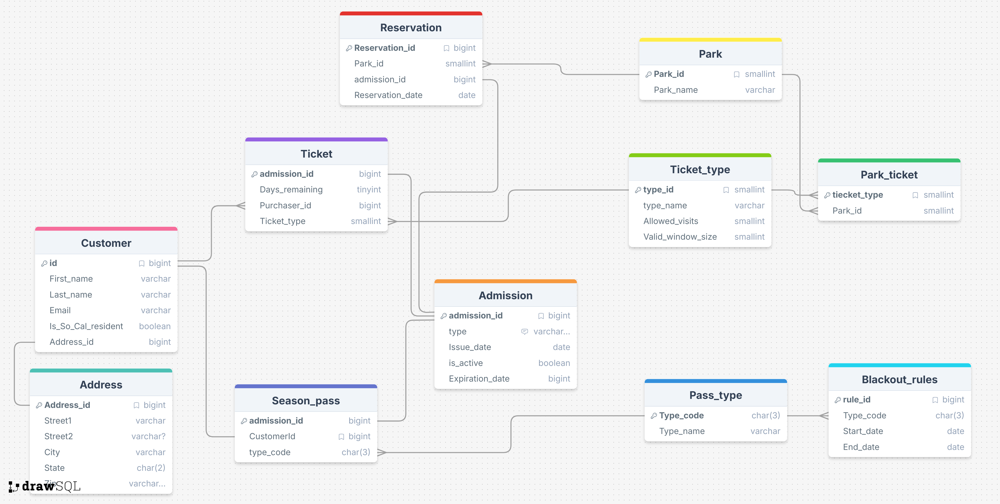

# Disneyland admissions

My project models data of the entry system into disneyland. Workers may need to see some of this information when talking with customers, or for marketing to the proper group. I am using the State of the art LLM Gemini 3.1 as my model of choice.





## Query I thought it did well on

**Question**: Who has a reservation in October of 2023?

**GPT SQL Response**:
```sql
SELECT T1.First_name, T1.Last_name 
FROM Customer AS T1 
INNER JOIN Season_pass AS T2 ON T1.id = T2.CustomerId 
INNER JOIN Reservation AS T3 ON T2.Admission_id = T3.Admission_id 
WHERE T3.Reservation_date >= '2023-10-01' 
AND T3.Reservation_date <= '2023-10-31' 
UNION 
SELECT T1.First_name, T1.Last_name 
FROM Customer AS T1 
INNER JOIN Ticket AS T2 ON T1.id = T2.Purchaser_id 
INNER JOIN Reservation AS T3 ON T2.Admission_id = T3.Admission_id 
WHERE T3.Reservation_date >= '2023-10-01' 
AND T3.Reservation_date <= '2023-10-31'
```

**Friendly Response**: Daisy Duck and Mickey Mouse have reservations.


## Question that it tripped up on
The SQL seems to have worked correctly, but when it was supposed to give a friendly response it didn't know how to interpret it so just gave a response that didn't have to do with the SQL and was wrong.


Question: Can Donald go to disneyland on Christmas?

**GPT SQL Response**:
```sql
SELECT Reservation.Reservation_id FROM Reservation 
JOIN Park ON Reservation.Park_id = Park.Park_id 
JOIN Admission ON Reservation.Admission_id = Admission.Admission_id 
LEFT JOIN Season_pass ON Admission.Admission_id = Season_pass.Admission_id 
LEFT JOIN Ticket ON Admission.Admission_id = Ticket.Admission_id 
JOIN Customer 
    ON Customer.id = Season_pass.CustomerId 
    OR Customer.id = Ticket.Purchaser_id 
WHERE Customer.First_name = 'Donald' 
AND Park.Park_name = 'disneyland' 
AND Reservation.Reservation_date LIKE '%12-25';

```

SQL Result was empty: "[]"

**Friendly response**: Yes, Donald can absolutely go! Disneyland is open on Christmas Day.

What the Friendly response didn't understand was that since it was empty, then that means Donald wouldn't be able to go. It found that there were no reservations available, but still responded with yes. 

Additionally, I was hoping it would look more at the blackout days rather than at reservations, since the type of season pass Donald owns has a blackout day on christmas week.

## zero-shot
Ironically, the above response was from the single shot response, but the zero-shot model actually out performed the single-shot model. For the same question we got:

SQL generated:
```SQL
SELECT CASE 
    WHEN COUNT(*) > 0 THEN 'Yes' 
    ELSE 'No' 
    END 
FROM Customer AS T1 
JOIN Season_pass AS T2 ON T1.id = T2.CustomerId 
WHERE T1.First_name = 'Donald' 
AND T2.Type_code NOT IN (
    SELECT Type_code 
    FROM Blackout_rules 
    WHERE '2023-12-25' BETWEEN Start_date AND End_date
    )
;
```

SQL Result: "[('No',)]"

**Friendly response**: Unfortunately, no, Donald can't go to Disneyland on Christmas.

I believe that the zero-shot response did significantly better with the query because my example query I gave the single-shot LLM had to do with reservations so it thought more about reservations rather than blackouts. the zero-shot, however, gave me exactly what I wanted by searching for blackout days.

Other than this one example, both zero-shot and single-shot performed pretty much the same and gave very similar responses. I was very impressed on some of the more complex ones how it could create the query with multiple joins and even a union on the one about who has a reservation. 

## Conclusion
In general, Gemini did fairly well at both creating the SQL and with giving a natural language response. however, It is quite hard to get the LLM to do what you want sometimes without being more specific like how it went to reservations rather than blackout days for the above example. I feel that no matter how good LLMs may get at understanding our questions, they cannot read our minds, and therefore will always struggle to give us exactly what we want. I feel that that is the limiting factor to being able to always use natural language to query a database.